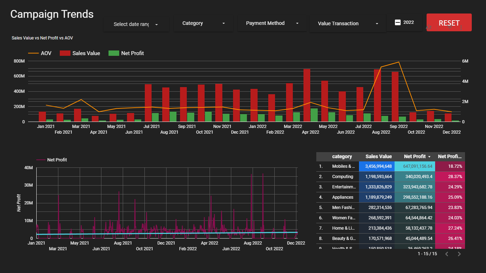
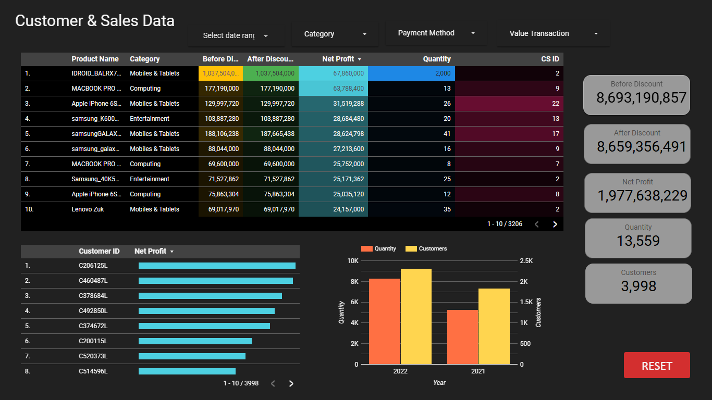
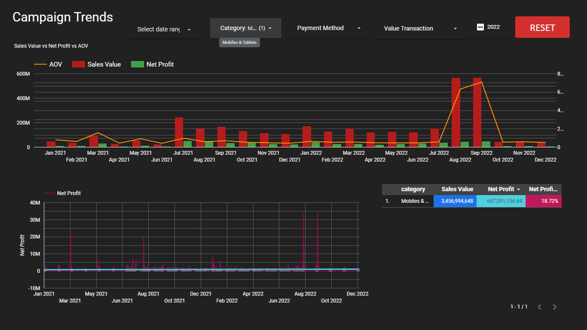
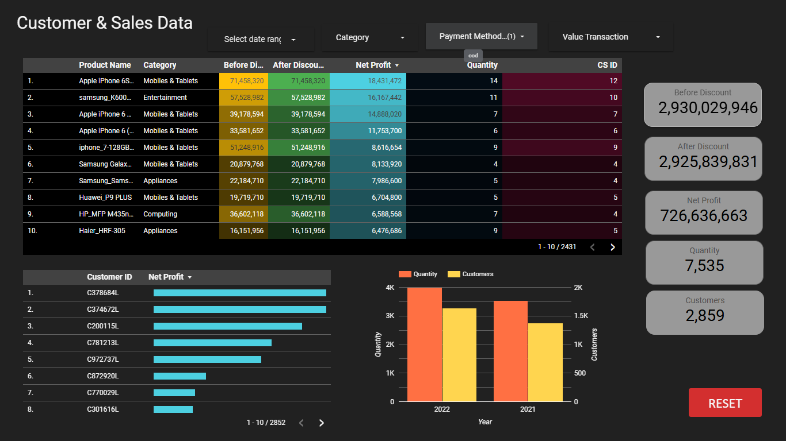

# 📊 Sales Analysis Dashboard — SQL + Python + Looker Studio

This project showcases a complete sales analysis pipeline from **data extraction using SQL**, **data analysis in Python**, and **interactive visualization using Google Looker Studio**. It covers key performance metrics like revenue trends, payment breakdowns, and category-wise insights.

---

## 🔁 Project Workflow

1. **📦 Dataset Creation using SQL**
   - Generated base datasets using raw transaction data
   - Joined and filtered across customers, orders, products (SKUs), and payments
   - Final dataset exported to CSV for visualization

2. **🐍 Python Analysis**
   - Performed data merging and cleaning using Pandas
   - Exploratory analysis using Matplotlib and basic KPIs

3. **📊 Looker Studio Dashboard**
   - Created a multi-section dashboard to display:
     - Revenue KPIs
     - Monthly sales trends
     - Category-wise and payment method performance

---

## 📁 Files in This Repository

| File | Description |
|------|-------------|
| `question and answer.sql` | SQL scripts to create and analyze datasets |
| `Merging and Analysis.ipynb` | Python notebook for merging and EDA |
| `customer_details.csv` | Customer information dataset |
| `order_details.csv` | Sales order records |
| `sku_details.csv` | Product/SKU-level metadata |
| `payment_details.csv` | Payment method and transaction records |
| `final_dataset.csv` | Fully merged dataset used in Looker Studio |
| `dashboard-overview.png` | KPI and overview section |
| `dashboard-overview1.png` | Monthly revenue breakdown |
| `category-wise-sales.png` | Pie and bar chart for category-level sales |
| `payment-wise-performance.png` | Analysis of payment modes |
| `README.md` | This documentation file |

---

## 📸 Dashboard Snapshots

### 🔹 Overall KPI Dashboard

### 🔹 Monthly Sales Trend

### 🔹 Category-Wise Sales Analysis

### 🔹 Payment Method Performance

---

## 📊 Tools & Tech Stack

- **SQL** – Data modeling, joins, aggregations  
- **Python (Pandas)** – Data merging, EDA  
- **Google Sheets** – Data source for Looker Studio  
- **Google Looker Studio** – Final visualization

---

## 🔗 Live Report Link (Optional)

> [🔗 View Looker Studio Dashboard](https://lookerstudio.google.com/reporting/d4e64112-69c0-475a-9bd7-b0ffe9dc94a9)

---

## 👨‍💻 Developed By

**Vignesh S**  
B.E. Computer Science  
[GitHub](https://github.com/Vigneshsaravanan12) | [LinkedIn](https://www.linkedin.com/in/vignesh-s-14273a334)

